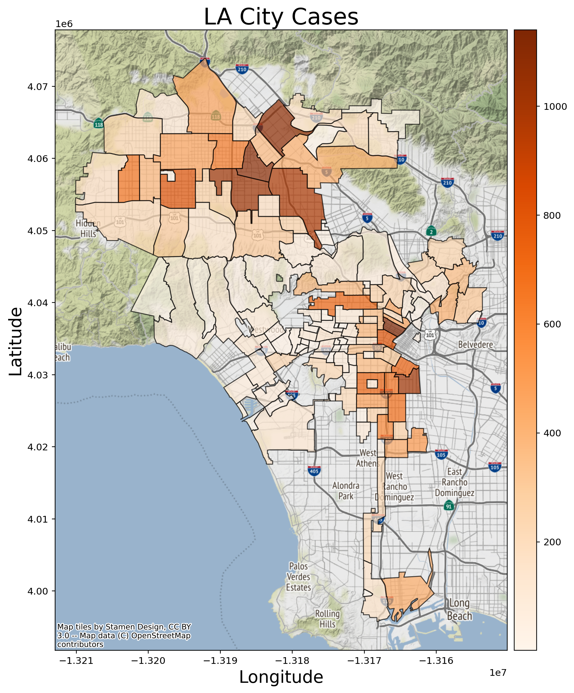
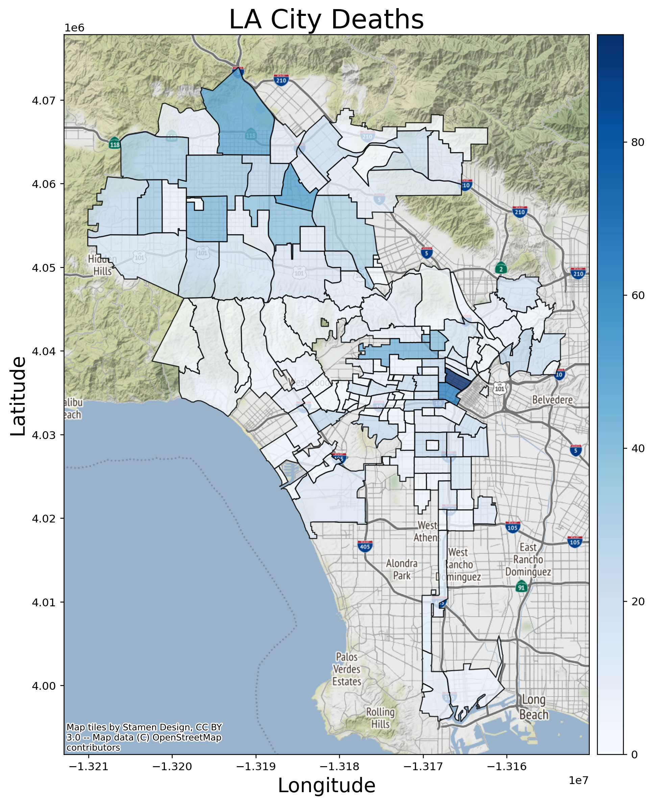
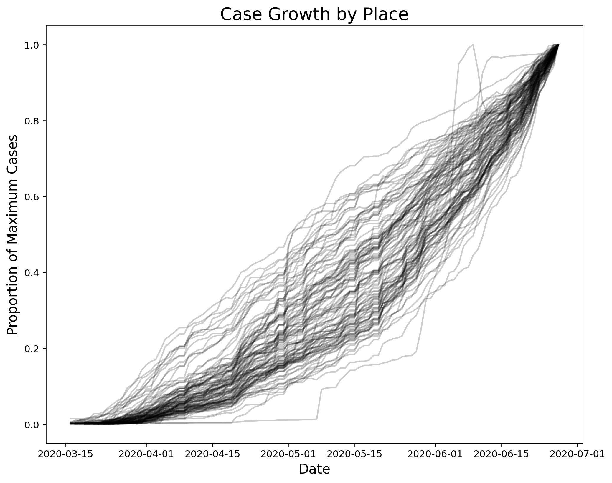

# COVID-19 assessment for the City of Los Angeles 

The COVID-19 pandemic has provoked social and economic upheaval across the globe. Political leaders at all levels are seeking appropriate measures to ensure the safety of their populations while minimizing the negative impacts of a total shut down. It is necessary to have accurate data on the spatial and temporal distribution of cases and deaths so that 1) resources can be administered to those communities most impacted and 2) a set of diagnostic metrics can be established to indicate when the city can return to normal operation.

### Methods and Data

I use geopandas to generate maps showing case numbers by neighborhood in Los Angeles and LA County. These are useful for determining where active hotbeds of infection are located and offer insight into which communities are most infected. This assessment is focused on the LA City response, however infection does not obey political boundaries so I have included LA County data as well to put the city into regional context.

The most important pandemic metric to evaluate is the rate of infection. The LA Times maintains a COVID database that is updated daily and provides a time series record of confirmed cases. In examining this data it is possible to observe temporal trends that indicate the rate at which the disease is spreading. 

**Data Sources (current as of June 28, 2020):**

LA City COVID Cases by Neighborhood: [LA City Shapefile](http://geohub.lacity.org/datasets/covid19-by-neighborhood-1?geometry=-120.114%2C33.645%2C-116.711%2C34.442)

LA County Neighborhood Shapefiles: [LA County Shapefile](http://boundaries.latimes.com/set/la-county-neighborhoods-current/)

LA Times COVID Data: [LA Times GitHub](https://github.com/datadesk/california-coronavirus-data)

### Results

I present two maps below, both are for the city of Los Angeles. These are used to show the neighborhoods that are most impacted by the COVID-19 pandemic. The first shows the number of cases by neighborhood and the second shows the number of deaths by neighborhood.

The map above shows the breakdown of cases by neighborhood in Los Angeles. Note that the regions with the highest numbers of cases are found in areas of higher population density just south and east of downtown as well as a significant number of cases in the San Fernando Valley. There may be some bias introduced here since it is likely that there are more cases in regions with higher population.

The map above shows the breakdown of deaths by neighborhood in Los Angeles. The same general pattern is observed as in the previous map. Those neighborhoods with the highest numbers of infections also see the highest numbers of deaths.

A similar pattern is observed at the county scale, communities with higher population density and generally lower economic status on the south and near east sides have the highest numbers of cases. While this assessment is focused on the City of Los Angeles, it is useful to remember that people travel regularly across district boundaries. This means that adjacent communities are likely to have similar responses even if they are in different munincipalities.

#### Time Distribution

More informative than the total number of cases is the rate at which new cases are appearing. In epidemiology there is the concept of "flattening the curve", an idea that measures can be taken that will slow the rate of infection so that the health care system can keep up with the active cases. Infection rate is a very difficult parameter to measure because each community may be exposed at a different time, so there can be a time lag as the infection moves from region to region. 

The graph above shows the proportion of cases as a time series for each subregion of LA County. Each line is from a specific subregion and is normalized by the maximum number of cases in that subregion. Note that each curve begins at zero in early March when there were no confirmed cases. More importantly, each curve terminates at one in late June. This indicates that every region is currently experiencing it's maximum recorded case number. The shape of the line in between shows whether the rate of infection is increasing (curving up) or decreasing (flattening out). While there are a couple regions that appear to flatten out, the vast majority of subregions are either steadily increasing or are accelerating the rate at which new cases appear.

### Conclusions and Recommendations

The time series data show conclusively that the number of cases is rapidly increasing across LA County and this trend is likely consistent within Los Angeles city limits as well. It is difficult to determine whether quarantine efforts have been effective in minimizing the infection rate since there is a lack of data from before March 15 when the stay at home order went into effect. There is also the matter of testing, which did not ramp up until mid April in the United States. It is difficult to determine how much the increase in confirmed cases is due to the increase in testing. The best way to improve this estimate is to keep testing at as high a rate as possible and try to keep the number of tests administered within each nieghborhood proportional to its population. This will help to remove some of the sampling bias that could be introduced by over testing in some neighborhoods and under testing in others.

There are specific neighborhoods that are affected more than others. From personal experience in the Los Angeles region these appear to be neighborhoods with higher population density and lower socioeconomic status. The next step in this spatial analysis is to incorporate 2010 census data to look at the demographic breakdown of the hardest hit communities. This will give some idea of community risk factors and help to guide relief resources where they are most needed.
